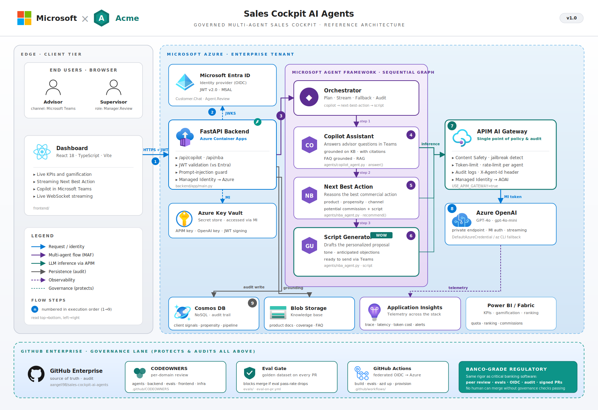

<div align="center">

<picture>
  <source media="(prefers-color-scheme: dark)" srcset="frontend/public/brand-logo-dark.svg" />
  
</picture>

# Sales Cockpit AI Agents

**An agentic commercial cockpit + a Copilot in Microsoft Teams for relationship bankers — governed by Microsoft.**

`React 18` · `TypeScript` · `Vite` · `Tailwind` &nbsp;•&nbsp; `FastAPI` · `Azure OpenAI` · `Microsoft Agent Framework` &nbsp;•&nbsp; `Bot Framework (Teams)` · `Azure Container Apps` · `Static Web Apps`

### ▶ [Live demo](https://agreeable-flower-09b095e03.7.azurestaticapps.net)

<sub>Brand-agnostic preset · the Intro mode runs entirely on mock data (no backend required).</sub>

</div>

---

A **white-label reference implementation** of an AI **sales cockpit** for a bancassurance /
retail-banking network: it gives relationship bankers **live KPIs and gamification**, streams the
**Next Best Action** for each client in real time (product, propensity, channel, timing, **estimated
commission** and a ready-to-send opening script), and embeds a **grounded Copilot assistant inside
Microsoft Teams** that answers product questions **with citations**. Built end-to-end on **Microsoft
AI**, it ships brand-agnostic (placeholder brand **“Acme”**) so it can be rebranded for any client or
vertical in minutes (see [`BRANDING.md`](BRANDING.md)).

> It first **wows visually** (the Intro mode — a cinematic, zero-backend walkthrough), then proves
> it's **real**: the Live mode runs on **Azure OpenAI** with token-by-token streaming, and the same
> Copilot agent is reachable from **Microsoft Teams** through the bundled Bot Framework bot.



---

## ✨ What it does

| | |
|---|---|
| 📊 **Live KPI cockpit + gamification** | Commercial KPIs, ranking and challenges update live over **WebSocket** — the banker sees objectives, progress and league position at a glance. |
| 🧠 **Streaming Next Best Action** | For each client the agent **reasons in real time** (token-by-token, Azure OpenAI) over CRM / transactional / behavioural signals and recommends the **best commercial action**: product, propensity, channel, timing, estimated **premium & commission**, and a personalized opening **script**. |
| 💬 **Copilot in Microsoft Teams** | A grounded assistant answers the banker's product / coverage / commission / retention questions **with citations** from the knowledge base — in the dashboard **and** natively inside **Microsoft Teams** (Bot Framework). |
| 📝 **Ready-to-act scripts** | Every recommendation comes with a natural opening line the banker can use or send, plus anticipated objections. |
| 🎬 **Two modes** | **Intro** — a high-impact visual demo that runs with zero backend. **Live** — the tool working for real on Azure OpenAI. Toggle in the header. |

> If the backend is unavailable, Live mode **degrades gracefully** to a high-fidelity simulated
> engine — the demo never breaks.

## 🧠 The agents — Microsoft Agent Framework

A sequential, governed graph orchestrated by the backend:

| Agent | Role | Source |
|---|---|---|
| **Copilot Assistant** | Answers the banker's questions in Teams / the dashboard, grounded on the knowledge base, **with citations** and suggested follow-ups. | `backend/app/agents/copilot_agent.py` · `answer()` |
| **Next Best Action** | Reasons the best commercial action for a client: product · propensity · channel · timing · estimated premium & commission. | `backend/app/agents/nba_agent.py` · `recommend()` |
| **Script Generator** | Drafts the personalized opening script (tone + anticipated objections) the banker sends — produced as part of the NBA result. | `nba_agent.py` · `recommend()` → `script` |

All agents have **high-fidelity mock fallbacks**, so the experience holds up with or without Azure.

## 🏗️ Microsoft stack shown "behind the magic"

**Microsoft 365 Copilot + Microsoft Teams** (delivery surface) · **Azure AI Foundry / Microsoft
Agent Framework** · **Azure OpenAI** · Azure Cosmos DB · **Power BI / Fabric** (KPIs · gamification ·
ranking) · Microsoft Entra ID · **Azure API Management** (AI Gateway) · Azure Container Apps · Azure
Static Web Apps · GitHub (CODEOWNERS · Eval Gate · Actions).

## 📁 Repository layout

```
sales-cockpit-ai-agents/
├── frontend/        React 18 + TS + Vite + Tailwind dashboard (Intro + Live modes)
│   ├── src/brand.ts             ← single source of truth for the brand
│   └── public/brand-logo.svg    ← swappable brand logo + favicon.svg
├── backend/         FastAPI + Azure OpenAI live engine
│   └── app/agents/              ← copilot_agent.py · nba_agent.py (+ mock fallbacks)
├── teams-bot/       Microsoft Bot Framework bot that surfaces the Copilot inside Teams
│   └── appManifest/             ← Teams app package (icons + manifest.json)
├── images/          Generated architecture diagrams (es + en)
├── tools/           gen_arch_svg.py — regenerates the diagrams (brand-tokenized)
└── BRANDING.md      How to rebrand everything in minutes
```

## 🚀 Quickstart

**1) Backend** (Live mode · needs `az login` for Azure OpenAI):

```powershell
cd backend
az login                         # once, for the Azure OpenAI token (no keys)
.\run.ps1                        # creates venv, installs deps, runs FastAPI on :8000
```

Check: `curl http://localhost:8000/api/health` → `"mode": "live"`.

**2) Frontend**:

```powershell
cd frontend
npm install
npm run dev                      # http://localhost:5173
npm run build                    # production build
```

Open the app, toggle **EN VIVO** (Live) in the header and pick a client to stream a Next Best
Action. Without a backend, the **Intro** mode alone is a complete, self-contained visual demo.

## 💬 Copilot inside Microsoft Teams

The bundled [`teams-bot/`](teams-bot) is a **Microsoft Bot Framework** bot (Python) that surfaces
the same Copilot agent inside Teams — it does **not** reimplement the agent, it calls the backend
`/api/copilot/chat` and renders the answer + citations + follow-ups as an **Adaptive Card**.

```powershell
cd teams-bot
copy .env.example .env           # fill the Azure Bot registration credentials
.\run.ps1                        # bot on :3978
```

Register an **Azure Bot**, point its messaging endpoint at `/api/messages` (via an HTTPS tunnel for
local testing), and side-load `appManifest/` into Teams. Details in
[`teams-bot/README.md`](teams-bot/README.md).

## 🎨 White-labeling

Shipped brand-agnostic. To make it yours, edit **one config file and a couple of assets** — full
guide in [`BRANDING.md`](BRANDING.md):

- `frontend/src/brand.ts` — name, product, tagline, colors (single source of truth).
- `frontend/public/brand-logo.svg` + `favicon.svg` — drop in your logo.
- `frontend/tailwind.config.js` + `src/index.css` — primary color palette.
- `BRAND_NAME` env var on the **backend** and the **teams-bot** — the brand the agents speak as.
- `tools/gen_arch_svg.py` — regenerate the architecture diagram with your brand tokens.

## ☁️ Deploy

- **Frontend** → Azure **Static Web Apps** (`npm run build`, deploy `dist/`).
- **Backend** → Azure **Container Apps** (Dockerfile included; auth to Azure OpenAI via managed
  identity, no keys). Point the frontend at it with `VITE_LIVE_API` at build time.
- **Teams bot** → Azure **Container Apps** / App Service + an **Azure Bot** resource.

## ⚠️ Disclaimer

Conceptual demo with **fictional data and illustrative knowledge**. Not a production product and not
affiliated with any real brand; **“Acme”** is a generic placeholder. The Microsoft product names and
logos belong to Microsoft and denote the technologies showcased.
